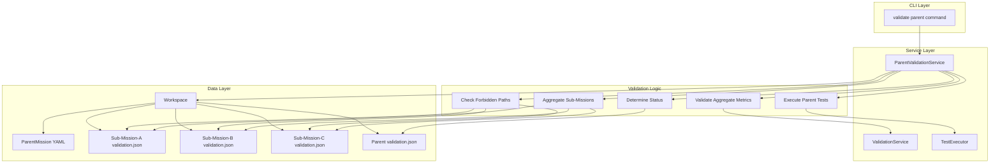
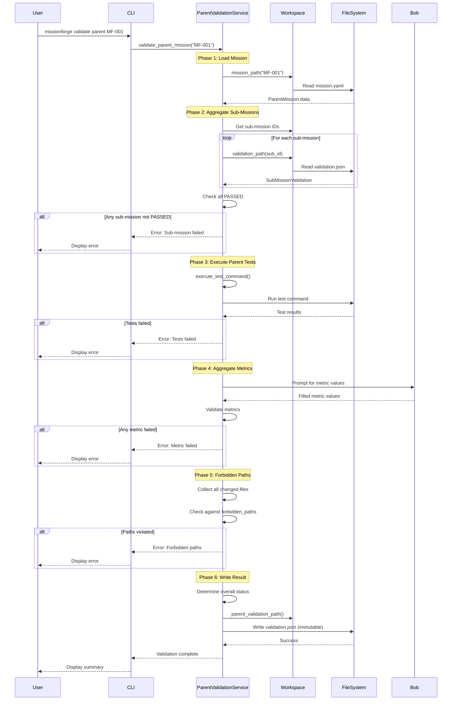
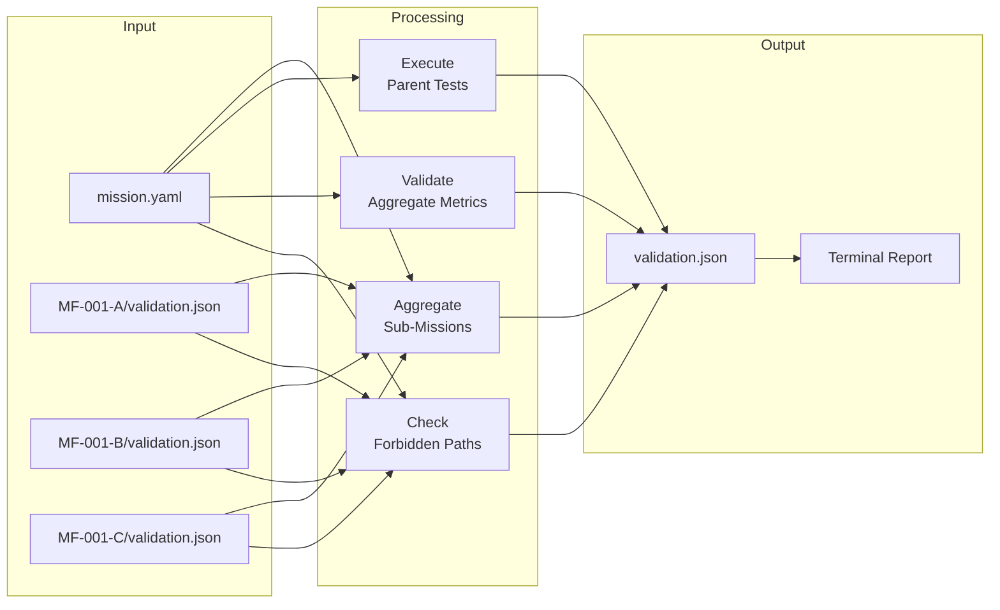
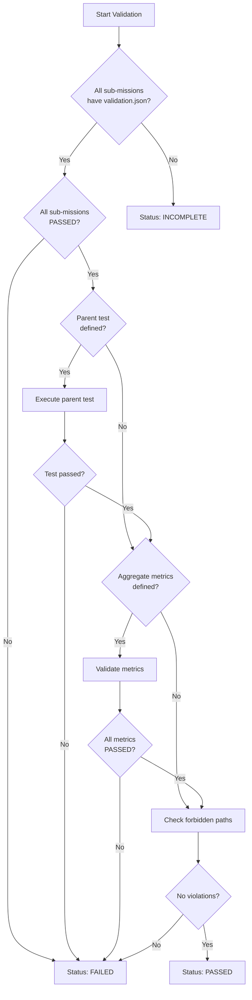
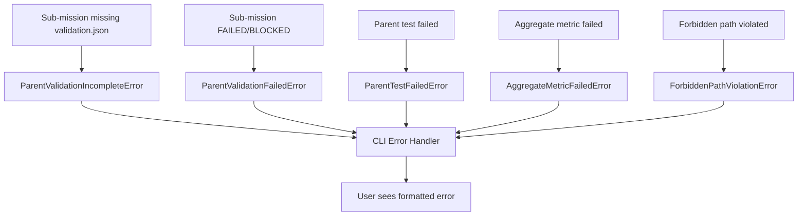
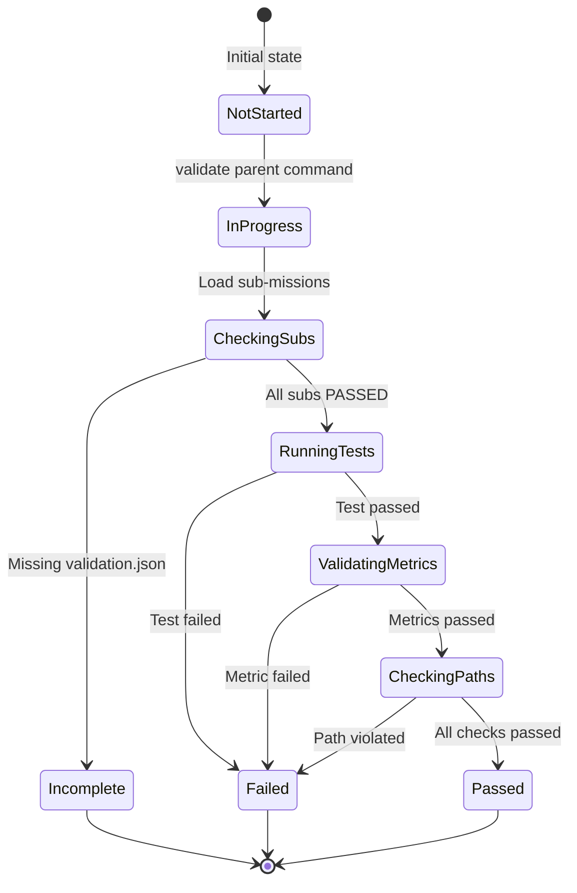

# MF-010: Parent Mission Validation - Architecture & Data Flow

## System Architecture



## Validation Flow Sequence



## Data Flow Diagram



## Status Determination Logic



## Component Interaction Matrix

| Component | Reads From | Writes To | Depends On |
|-----------|-----------|-----------|------------|
| CLI Command | User input | Terminal output | ParentValidationService |
| ParentValidationService | mission.yaml, sub-mission validation.json | parent validation.json | Workspace, TestExecutor |
| Workspace | File system | - | - |
| TestExecutor | Test command | Test output | subprocess_utils |
| ValidationService | - | - | Used for metric logic |

## Error Propagation



## File System Layout

```
.missionforge/
└── missions/
    └── MF-001/                          # Parent mission directory
        ├── mission.yaml                 # Parent mission definition
        ├── plan.yaml                    # Execution plan
        ├── validation.json              # ← NEW: Parent validation result
        └── sub-missions/
            ├── MF-001-A/
            │   ├── sub-mission.yaml
            │   ├── baseline.json
            │   └── validation.json      # Sub-mission validation (input)
            ├── MF-001-B/
            │   ├── sub-mission.yaml
            │   ├── baseline.json
            │   └── validation.json      # Sub-mission validation (input)
            ├── MF-001-C/
            │   ├── sub-mission.yaml
            │   ├── baseline.json
            │   └── validation.json      # Sub-mission validation (input)
            └── MF-001-D/
                ├── sub-mission.yaml
                ├── baseline.json
                └── validation.json      # Sub-mission validation (input)
```

## Validation States



## Key Design Decisions

### 1. Two-Level Validation
**Decision**: Parent validation is separate from sub-mission validation
**Rationale**: Allows catching integration issues that individual sub-missions miss
**Impact**: Parent can fail even if all sub-missions pass

### 2. Immutable validation.json
**Decision**: Parent validation.json is read-only after creation
**Rationale**: Provides audit trail and prevents tampering
**Impact**: Must use --force flag to re-validate

### 3. Aggregate Metrics via Bob
**Decision**: Bob measures aggregate metrics, not CLI
**Rationale**: Maintains language-agnostic CLI design
**Impact**: Requires Bob interaction during validation

### 4. Cross-Sub-Mission Forbidden Paths
**Decision**: Check forbidden paths across ALL sub-mission changes
**Rationale**: Prevents circumventing restrictions by splitting work
**Impact**: More comprehensive validation than individual checks

### 5. Status Hierarchy
**Decision**: INCOMPLETE < FAILED < PASSED
**Rationale**: Clear distinction between not-ready and failed
**Impact**: Different error messages and recovery paths

## Performance Characteristics

| Operation | Time Complexity | Space Complexity | Notes |
|-----------|----------------|------------------|-------|
| Load sub-missions | O(n) | O(n) | n = number of sub-missions |
| Aggregate status | O(n) | O(1) | Single pass through sub-missions |
| Execute tests | O(t) | O(1) | t = test execution time |
| Validate metrics | O(m) | O(m) | m = number of metrics |
| Check paths | O(n*p) | O(n*p) | n = sub-missions, p = paths per sub |

## Security Considerations

1. **File Permissions**: validation.json is read-only (444)
2. **Path Validation**: All file paths validated to prevent traversal
3. **Command Injection**: Test commands sanitized before execution
4. **Output Sanitization**: Test output sanitized before display
5. **Metric Validation**: Type checking on all metric values

## Extensibility Points

1. **Custom Validators**: Plugin system for custom validation logic
2. **Custom Metrics**: Support for domain-specific aggregate metrics
3. **Custom Formatters**: Different output formats (JSON, HTML, etc.)
4. **Notification Hooks**: Webhooks for validation completion
5. **Report Generators**: Custom report generation from validation.json