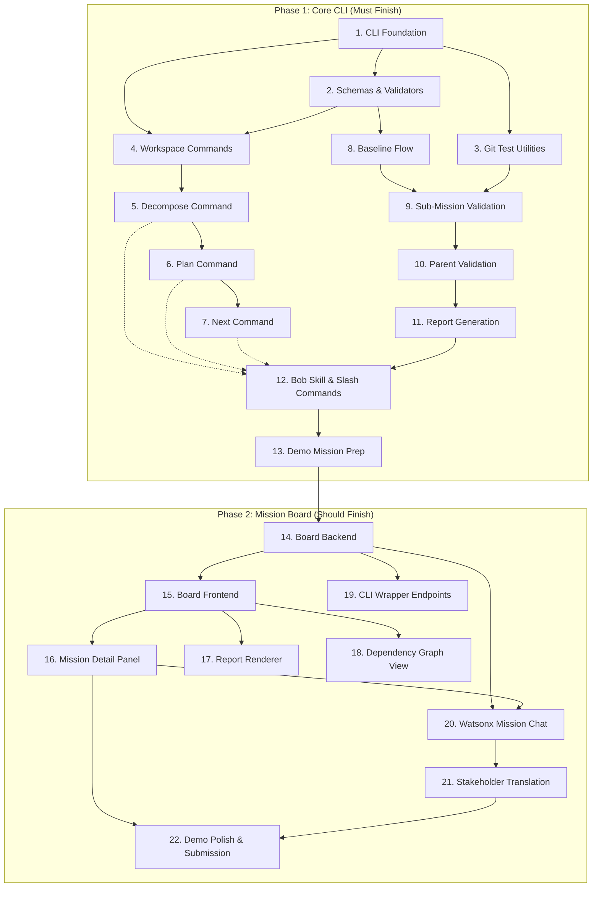

# MissionForge Development Roadmap & Dependency Graph

This document outlines the development strategy for MissionForge, detailing task dependencies, parallel work streams, and the critical path for a 24-hour development cycle.

## 📊 Dependency Graph

The following graph visualizes the relationships between the various development tasks. 

---

## 🚀 Development Roadmap

### Phase 1: Core CLI Harness (Critical Path)
**Estimated Time:** 16-20 hours

1.  **CLI Foundation (4-6h):** Setup the base CLI structure using Click or Typer.
2.  **Schemas & Validators (3-4h):** Define `.missionforge/` YAML schemas and validation logic.
3.  **Git Test Utilities (2-3h):** Helper functions for git-based validation and testing.
4.  **Workspace Commands (2-3h):** `init`, `status`, and workspace management.
5.  **Decompose Command (3-4h):** Logic to break parent missions into sub-missions.
6.  **Plan Command (3-4h):** Generate dependency graphs and sequence plans.
7.  **Next Command (2h):** Suggest the next logical task in the sequence.
8.  **Baseline Flow (3-4h):** Establish the "ground truth" for mission progress.
9.  **Sub-Mission Validation (4-5h):** Validate individual task completion.
10. **Parent Validation (3h):** Aggregate sub-mission data to validate parent state.
11. **Report Generation (3h):** Generate evidence-based completion reports.
12. **Bob Skill & Slash Commands (2-3h):** Integrate CLI with Bob Skill ecosystem.
13. **Demo Mission Prep (4-5h):** Curate sample missions for the final presentation.

### Phase 2: Mission Board (Enhancement)
**Estimated Time:** 12-16 hours

14. **Board Backend (3-4h):** FastAPI/Node server to expose CLI state.
15. **Board Frontend (4-5h):** Next.js/React application for visual tracking.
16. **Mission Detail Panel (3h):** Detailed view of individual mission progress and evidence.
17. **Report Renderer (2h):** Web-based visualization of generated reports.
18. **Dependency Graph View (3-4h):** (Nice-to-have) Visual DAG of missions.
19. **CLI Wrapper Endpoints (2h):** Allow Board to trigger CLI actions via API.
20. **Watsonx Mission Chat (3-4h):** AI-powered chat for querying mission status.
21. **Stakeholder Translation (3h):** Translate technical reports for business stakeholders.
22. **Demo Polish & Submission (5-7h):** Final integration, bug fixing, and recording.

---

## 🛠️ Parallel Work Streams (4-Dev Plan)

| Time Window | Dev A (CLI Core) | Dev B (CLI Validation) | Dev C (Board Backend) | Dev D (Board Frontend) |
| :--- | :--- | :--- | :--- | :--- |
| **0–6h** | Foundation | Schemas + Git Utils | API Contract + FastAPI | API Contract + Next.js |
| **6–14h** | Workspace + Decompose | Baseline + Sub-Validation | Backend Logic (Fixtures) | Frontend UI (Mocks) |
| **14–22h** | Plan + Next | Parent-Val + Reports | Watsonx + Endpoints | Detail Panel + Real API |
| **22–24h** | Demo Prep | Bob Skill Integration | Hardening | Polish + Submission |

---

## ⚡ Critical Path Summary

1.  **Sync (0-2h):** API Contract & Schema Agreement.
2.  **Foundation (2-6h):** CLI Core and YAML schemas.
3.  **Core Logic (6-14h):** Decomposition and individual validation.
4.  **Integration (14-20h):** Parent validation, report generation, and backend/frontend sync.
5.  **Finalize (20-24h):** Demo preparation and polish.

> [!IMPORTANT]
> The **Critical Path** runs through Dev A and Dev B. Dev C and Dev D have some slack but are dependent on the API contract landing in the first 2 hours.
